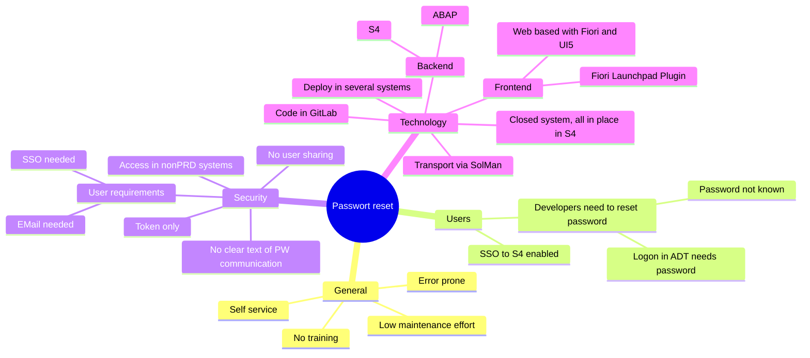
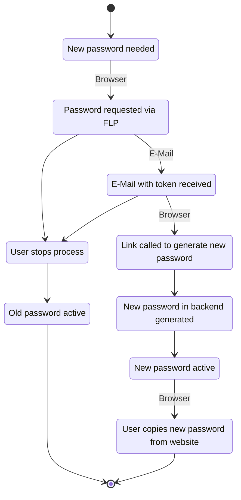
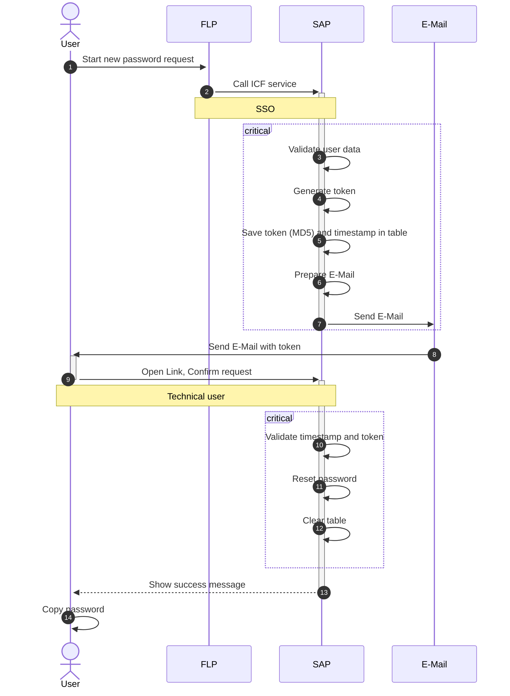

# Password Self Service Reset Fiori Launchpad Plugin

## Overview requirements

The functional and non-functional requirements are listed in the following mindmap.

## State

Throught the usage of the app, several possible states can occur. Depending on what the user decides, the password gets resetted or not.

## Components

The main components of the solutions are:

Backend: 
* S/4HANA ABAP
* Internal tables for token and user storage
* ICF nodes for communication

Frontend:
* FLP with plugin
* Confirmation page with new password

## Sequence diagram

The process is always triggered by the user. The FLP plugin is taking care of the steps outline in #1 and #2.

